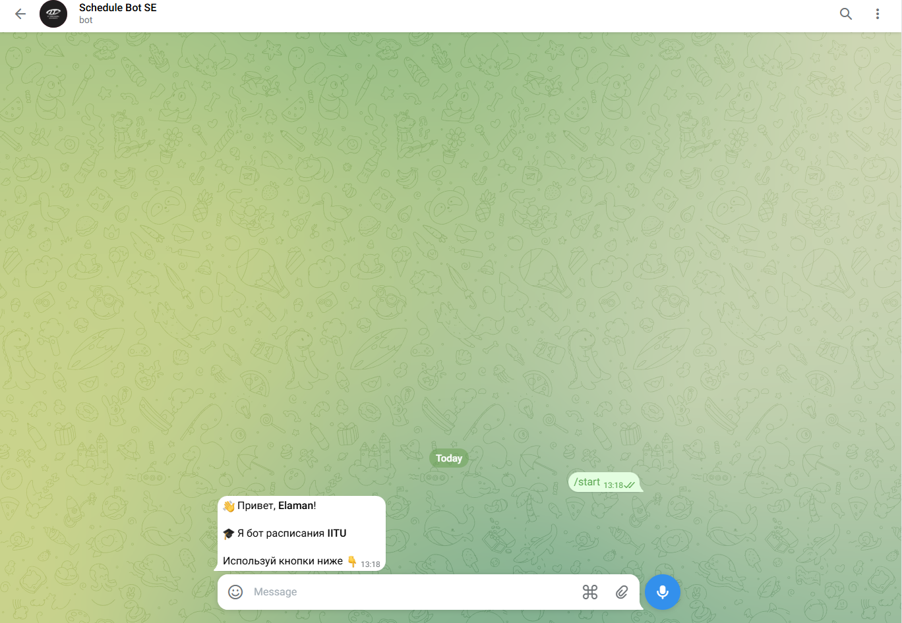
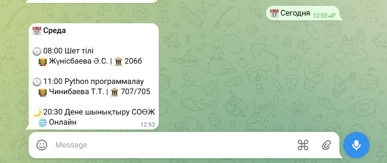
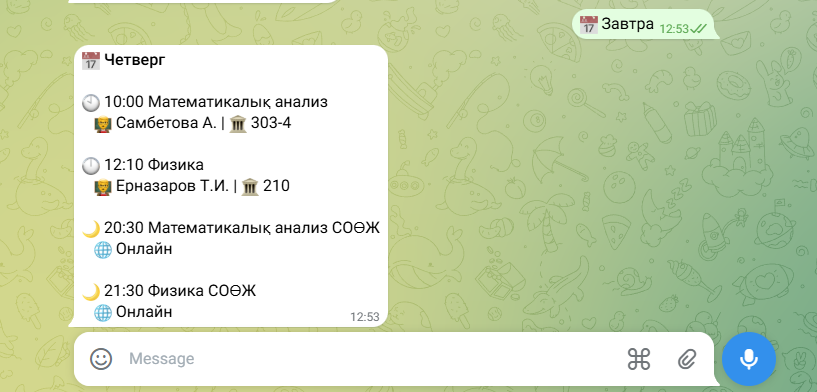
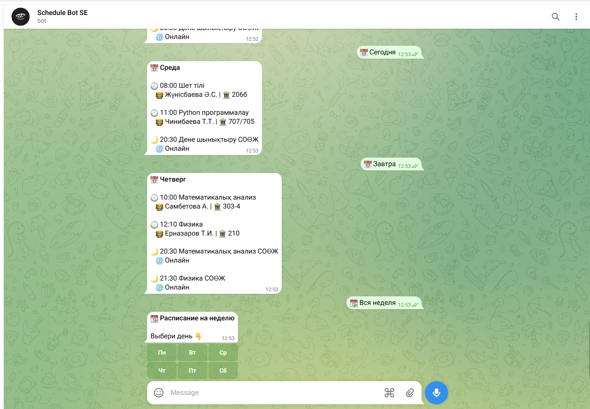
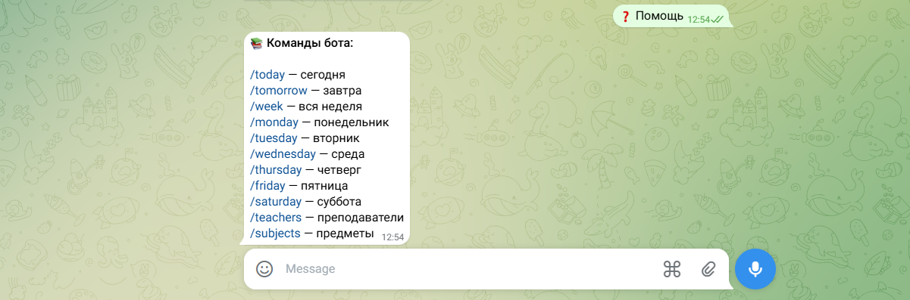

# IITU Schedule Bot

> **Telegram schedule bot for IITU students**  
> Final Project — Python Programming | IITU 

---

## Project Description

**IITU Schedule Bot** is a Telegram bot that helps IITU students quickly and conveniently view their class schedule directly in the messenger.

The bot allows users to:
- 📅 View the schedule for **today** and **tomorrow**
- 📆 View the schedule for the **entire week**
- 👨‍🏫 Get a list of **teachers** and their subjects
- 📚 View the list of all **subjects**
- ⌨️ Use convenient **buttons** instead of commands
- 🗄️ Store data in **JSON file**

---

## Technologies Used

| Technology | Purpose |
|-----------|-----------|
| Python 3.14 | Main programming language |
| aiogram 3.x | Telegram Bot Framework |
|JSON|User data storage|
| asyncio | Asynchronous programming |
| BeautifulSoup4 | Web scraping |
| requests | HTTP requests and Weather API |
| python-dotenv | Configuration management |
| regex (re) | Input validation |

---

## Project Structure

```text
PyCharmMiscProject/
│
├── bot.py                 # Main file — handlers and bot startup
├── schedule.py            # Schedule data for all 6 days
├── inline.py              # Reply and Inline keyboards
├── database.py            # JSON data storage
├── validators.py          # Regex validation (email, phone, URL)
├── bot_class.py           # OOP: BaseBot → ScheduleBot → AdminBot
├── sorting_searching.py   # Sorting and searching algorithms
├── states.py              # FSM dialogue states
├── iitu.py                # IITU news web scraping
├── .env                   # Configuration (token)
└── requirements.txt       # Dependencies
```

---

## Installation and Launch

### 1. Clone the project

```bash
git clone https://github.com/username/iitu-schedule-bot
cd iitu-schedule-bot
```

### 2. Install dependencies

```bash
pip install -r requirements.txt
```

### 3. Create a `.env` file

```env
BOT_TOKEN=your_botfather_token
DB_HOST=localhost
DB_PORT=5432
DB_NAME=iitu_schedule_bot
DB_USER=postgres
DB_PASSWORD=your_password
```

### 4. Create a PostgreSQL database

```sql
CREATE DATABASE iitu_schedule_bot;
```

### 5. Run the bot

```bash
python bot.py
```

---

## Bot Commands

| Command | Description |
|---------|---------|
| `/start` | Greeting and main menu |
| `/today` | Today's schedule |
| `/tomorrow` | Tomorrow's schedule |
| `/week` | Weekly schedule |
| `/monday` | Monday schedule |
| `/tuesday` | Tuesday schedule |
| `/wednesday` | Wednesday schedule |
| `/thursday` | Thursday schedule |
| `/friday` | Friday schedule |
| `/saturday` | Saturday schedule |
| `/teachers` | List of teachers |
| `/subjects` | List of subjects |
| `/help` | Help information |

---

## Screenshots

### Greeting — /start


### Control keyboard


### Today's schedule — /today


### Tomorrow's schedule — /tomorrow


### Weekly schedule — /week


### Teachers — /teachers


### Subjects — /subjects


### Help — /help


---

##  Database

The project stores data in  **data.json** file:

| Table      | Description                 |
|------------|-----------------------------|
| `users`    | User data(id,name,username) |
| `activity` | User activity logs          |
| `messages` | Message history             |

---

## OOP Architecture

```text
BaseBot (ABC)
    │
    ├── ScheduleBot       ← main schedule logic
    │       │
    │       └── AdminBot  ← administrative functions
    │
    └── Subject           ← subject model
```

- `BaseBot` — abstract class with `@abstractmethod`
- `ScheduleBot` — implements schedule formatting
- `AdminBot` — extends functionality with admin permissions

---

## Algorithms

| Algorithm | Complexity | Usage |
|---------|-----------|-----------|
| Bubble Sort | O(n²) | Schedule sorting (demo) |
| Quick Sort | O(n log n) | Main sorting |
| Linear Search | O(n) | Subject/teacher search |
| Binary Search | O(log n) | Time-based search |

---

- [x] Telegram interface with 15+ commands
- [x] Reply Keyboard and Inline Keyboard
- [x] User data storage in JSON
- [x] Error handling and unknown commands
- [x] Input validation using regex
- [x] Asynchronous programming (asyncio)
- [x] OOP: inheritance, polymorphism, encapsulation
- [x] Sorting and searching algorithms
- [x] Web scraping (BeautifulSoup4)
- [x] Secure token storage with .env
---
**Tussupbekov Yelaman**  
Group: SE-2510  
IITU — International Information Technology University  
